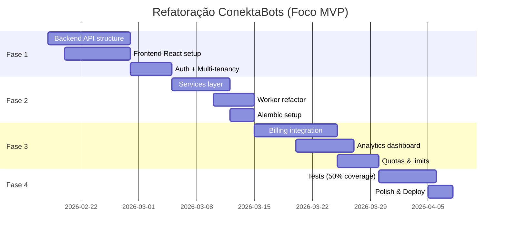

# 🚀 ConektaBots: Proposta de Refatoração para Plataforma Comercial

## 📊 Análise do Estado Atual

### Arquitetura Atual (MVP)

```
conekta-bots/
├── app.py                  # FastAPI monolítico (8KB)
├── worker.py               # Lógica de bot worker (10KB)
├── manager.py              # Inicializador de bots
├── database.py             # Modelos SQLModel
├── adicionar_bot.py        # Scripts CLI
├── adicionar_regra.py      # Scripts CLI
├── templates/              # 8 templates Jinja2
└── database.db             # SQLite
```

### ✅ Pontos Fortes

1. **Funcional e estável** - MVP rodando em produção
2. **Docker configurado** - Deploy automatizado via CI/CD
3. **Funcionalidades completas** - Bot management, regras, agendamentos, logs
4. **Tecnologias modernas** - FastAPI, async/await, Telethon
5. **Multi-tenancy básico** - Suporta múltiplos bots

### ❌ Pontos Fracos para Comercialização

1. **Arquitetura monolítica** - Front/back acoplados
2. **Sem autenticação/autorização** - Zero segurança multi-usuário
3. **SQLite** - Suficiente para MVP, migrar para PostgreSQL quando escalar
4. **Templates server-side** - UX limitada, sem SPA
5. **Lack of API structure** - Endpoints crescem sem organização
6. **Sem testes** - Zero cobertura de testes
7. **Hardcoded configs** - Sem gestão de ambientes

---

## 🎯 Stack Recomendada para Plataforma Comercial

### Backend (API)

```
FastAPI (mantém) ✅
├── Pydantic V2          → Validação e serialização
├── SQLAlchemy 2.0       → ORM robusto (vs SQLModel)
├── Alembic              → Migrations
├── SQLite               → Development (migrar para PostgreSQL depois)
└── pytest + pytest-cov  → Testes automatizados
```

**Por que FastAPI?**
- Já está no projeto (reduz curva de aprendizado)
- Performance excelente
- Type hints nativos
- OpenAPI automático
- Async nativo

> [!NOTE]
> **Redis/Celery**: Adiado para depois do MVP ser validado. Workers continuam usando asyncio por enquanto.

### Frontend (SPA)

```
React + TypeScript ⭐
├── Vite                 → Build tool moderno
├── TanStack Query       → Server state management
├── Zustand              → Client state (leve)
├── Tailwind CSS         → Styling rápido
├── shadcn/ui            → Componentes premium
├── React Hook Form      → Formulários
└── Recharts             → Dashboards/gráficos
```

**Alternativas:**
- **Next.js 15** - Se quiser SSR/SEO (melhor para landing page)
- **Vue 3 + Nuxt** - Se preferir sintaxe mais simples

### Infraestrutura & DevOps

```
Docker + Docker Compose ✅
Nginx (reverse proxy)
GitHub Actions (CI/CD) ✅ já tem
Cloudflare Tunnel ✅ já tem
```

> [!NOTE]
> **Observabilidade (Sentry/Prometheus/Grafana)**: Adiado. Focar no essencial do MVP primeiro.

---

## 🏗️ Arquitetura Proposta: Clean Architecture

### Estrutura de Diretórios

```
conekta-platform/
├── backend/
│   ├── alembic/                    # Database migrations
│   ├── app/
│   │   ├── api/
│   │   │   ├── v1/
│   │   │   │   ├── endpoints/
│   │   │   │   │   ├── auth.py
│   │   │   │   │   ├── bots.py
│   │   │   │   │   ├── rules.py
│   │   │   │   │   ├── schedules.py
│   │   │   │   │   └── analytics.py
│   │   │   │   └── router.py
│   │   │   └── deps.py             # Dependencies (get_db, get_current_user)
│   │   ├── core/
│   │   │   ├── config.py           # Pydantic Settings
│   │   │   └── security.py         # JWT, passwords
│   │   ├── models/                 # SQLAlchemy models
│   │   │   ├── user.py
│   │   │   ├── bot.py
│   │   │   ├── rule.py
│   │   │   └── log.py
│   │   ├── schemas/                # Pydantic schemas (DTOs)
│   │   │   ├── user.py
│   │   │   ├── bot.py
│   │   │   └── rule.py
│   │   ├── services/               # Business logic
│   │   │   ├── auth_service.py
│   │   │   ├── bot_service.py
│   │   │   ├── rule_service.py
│   │   │   └── telegram_service.py
│   │   ├── workers/                # AsyncIO workers (sem Celery por enquanto)
│   │   │   ├── bot_worker.py       # worker.py refatorado
│   │   │   └── scheduler_worker.py
│   │   ├── db/
│   │   │   ├── base.py
│   │   │   └── session.py
│   │   └── main.py                 # FastAPI app
│   ├── tests/
│   │   ├── unit/
│   │   ├── integration/
│   │   └── e2e/
│   ├── requirements/
│   │   ├── base.txt
│   │   ├── dev.txt
│   │   └── prod.txt
│   ├── Dockerfile
│   └── pyproject.toml
│
├── frontend/
│   ├── public/
│   ├── src/
│   │   ├── components/
│   │   │   ├── ui/                 # shadcn components
│   │   │   ├── layout/
│   │   │   │   ├── Header.tsx
│   │   │   │   ├── Sidebar.tsx
│   │   │   │   └── Layout.tsx
│   │   │   └── features/
│   │   │       ├── bots/
│   │   │       │   ├── BotList.tsx
│   │   │       │   ├── BotForm.tsx
│   │   │       │   └── BotCard.tsx
│   │   │       ├── rules/
│   │   │       └── dashboard/
│   │   ├── hooks/                  # Custom React hooks
│   │   ├── lib/
│   │   │   ├── api.ts              # Axios instance
│   │   │   └── utils.ts
│   │   ├── pages/
│   │   │   ├── Dashboard.tsx
│   │   │   ├── Bots.tsx
│   │   │   ├── Rules.tsx
│   │   │   ├── Analytics.tsx
│   │   │   └── Login.tsx
│   │   ├── store/                  # Zustand stores
│   │   │   └── authStore.ts
│   │   ├── types/
│   │   ├── App.tsx
│   │   └── main.tsx
│   ├── package.json
│   ├── tsconfig.json
│   ├── vite.config.ts
│   └── Dockerfile
│
├── nginx/
│   └── nginx.conf
├── docker-compose.yml
├── .env.example
├── docs/                           # Documentação
│   └── refactoring_proposal.md
└── README.md
```

---

## 🔄 Plano de Migração em Fases (MVP-FIRST)

### Fase 1: Separação Front/Back (2-3 semanas) 🟢 PRIORIDADE

#### Backend

1. **Criar estrutura de pastas** (`backend/app/`)
2. **Mover modelos** para `app/models/`
3. **Criar schemas Pydantic** em `app/schemas/`
4. **Refatorar `app.py`** em routers modulares:
   - `api/v1/endpoints/auth.py` → Login/Register/JWT
   - `api/v1/endpoints/bots.py` → CRUD bots
   - `api/v1/endpoints/rules.py` → CRUD rules
   - `api/v1/endpoints/schedules.py` → CRUD schedules

5. **Implementar autenticação**:
   ```python
   # app/core/security.py
   - JWT tokens (access + refresh)
   - Password hashing (bcrypt)
   - Middleware de autenticação
   ```

6. **Criar services layer**:
   ```python
   # app/services/bot_service.py
   class BotService:
       def create_bot(self, user_id, bot_data) -> Bot
       def get_user_bots(self, user_id) -> List[Bot]
       def activate_bot(self, bot_id, user_id) -> Bot
   ```

#### Frontend

1. **Setup Vite + React + TypeScript**
2. **Instalar dependências**:
   ```bash
   npm create vite@latest frontend -- --template react-ts
   cd frontend
   npm install @tanstack/react-query axios zustand
   npx shadcn-ui@latest init
   ```

3. **Criar estrutura base**:
   - Layout component
   - Auth context
   - API client (axios)
   - React Query setup

4. **Migrar telas (prioridade)**:
   - Login/Register
   - Dashboard
   - Bot Management
   - Rule Management

### Fase 2: Services + Database Migration (1-2 semanas) 🟡

1. **Manter SQLite durante desenvolvimento**:
   - Setup Alembic mesmo com SQLite
   - Criar migrations iniciais
   - Preparar código para ser database-agnostic

2. **Implementar Services**:
   ```python
   TelegramService → Abstração do Telethon
   BotService → Lógica de negócio de bots
   RuleService → Validação e processamento de regras
   AnalyticsService → Agregação de logs/métricas
   ```

3. **Refatorar Worker** (continuar com asyncio):
   ```python
   # workers/bot_worker.py
   # Manter asyncio por enquanto, não usar Celery ainda
   async def start_bot_worker(bot_id: int):
       bot_service = BotService()
       telegram_service = TelegramService()
       # ...
   ```

> [!IMPORTANT]
> **PostgreSQL**: Migração adiada. Só migrar do SQLite quando:
> - MVP validado com clientes reais
> - Performance do SQLite se tornar gargalo
> - Múltiplos workers concorrentes necessários

### Fase 3: Features Comerciais (2-4 semanas) 🔵

#### Multi-tenancy

```python
# models/user.py
class User(Base):
    id: UUID
    email: str
    plan: str  # free, pro, enterprise
    max_bots: int
    
# models/bot.py
class Bot(Base):
    owner_id: UUID  # FK → User
```

#### Billing (Stripe Integration)

```python
# api/v1/endpoints/billing.py
POST /api/v1/billing/subscribe
POST /api/v1/billing/cancel
GET  /api/v1/billing/invoices
```

#### Analytics Dashboard

```typescript
// frontend/src/pages/Analytics.tsx
<Recharts>
  - Mensagens processadas/dia
  - Taxa de sucesso
  - Bots ativos
  - Performance por regra
</Recharts>
```

#### Quotas & Limits

```python
# middleware/quota_middleware.py
- Rate limiting (por plano)
- Max bots por usuário
- Max regras por bot
```

### Fase 4: Testes & Polish (1 semana) 🟣

1. **Testes essenciais**:
   ```bash
   pytest tests/ --cov=app --cov-report=html
   # Target: 50%+ coverage (focar em business logic crítico)
   ```

2. **Logs estruturados básicos**:
   ```python
   import logging
   logger.info(f"Bot {bot_id} started for user {user_id}")
   ```

3. **CI/CD**:
   ```yaml
   # .github/workflows/deploy.yml
   - name: Run tests
   - name: Build Docker images
   - name: Deploy to production
   ```

---

## 💰 Modelos de Monetização Sugeridos

### Planos

| Feature | Free | Pro ($29/mês) | Enterprise ($99/mês) |
|---------|------|---------------|----------------------|
| Bots | 2 | 10 | Ilimitado |
| Regras | 5/bot | 50/bot | Ilimitado |
| Msgs/mês | 10k | 500k | Ilimitado |
| Suporte | Email | Priority | Dedicated |
| White-label | ❌ | ❌ | ✅ |

### Recursos Premium (Futuro)

- 📊 **Analytics avançado** - Dashboards personalizados
- 🤖 **Auto-resposta com IA** - Integração GPT
- 📱 **App mobile** - iOS/Android (React Native)
- 🔗 **Integrações** - Webhooks, Zapier, n8n
- 💾 **Backup automático** - Export de dados

---

## 🎨 UX/UI Melhorias

### Design System

```typescript
// Usar shadcn/ui + Tailwind
<Card>
  <CardHeader>
    <CardTitle>Bot Status</CardTitle>
  </CardHeader>
  <CardContent>
    <Badge variant="success">Active</Badge>
  </CardContent>
</Card>
```

### Features UX

1. **Real-time updates** - WebSockets para logs ao vivo
2. **Drag & drop** - Reordenar regras
3. **Wizard setup** - Onboarding guiado
4. **Template library** - Regras pré-configuradas
5. **Dark mode** - Tema claro/escuro

---

## ⚠️ Decisões Críticas

### SQLModel vs SQLAlchemy puro?

> **Recomendação: SQLAlchemy 2.0**
> - SQLModel é wrapper do SQLAlchemy, pode limitar features avançadas
> - ORM puro dá mais controle para queries complexas
> - Mantém Pydantic para schemas (separado de models)

### Quando migrar para PostgreSQL?

> **Gatilhos para migração:**
> - Mais de 100 usuários ativos
> - Performance do SQLite degradando
> - Necessidade de múltiplas instâncias (read replicas)
> - Features específicas do Postgres (full-text search, JSON queries)

### Deploy: Serverless (Lambda) vs VPS?

> **Recomendação: VPS (atual)**
> - Bots mantêm conexão WebSocket persistente (incompatível com serverless)
> - Manter Docker Compose para desenvolvimento e produção inicial
> - Considerar Kubernetes apenas se crescer muito (>500 bots simultâneos)

---

## 📈 Roadmap de Execução (MVP-First)



**Total estimado: ~7-8 semanas** (1.5-2 meses)

---

## 🚦 Próximos Passos Imediatos

### 1. Decisões a tomar:

- [ ] **Stack frontend**: React (SPA) ou Next.js (SSR/SEO)?
- [ ] **Modelo de monetização**: Assinatura mensal ou one-time payment?
- [ ] **Pricing**: Validar valores ($29/$99) com mercado

### 2. Setup inicial (Fase 1):

```bash
# Backend structure
mkdir -p backend/app/{api,core,models,schemas,services,workers,db}
cd backend
pip install fastapi sqlalchemy alembic "uvicorn[standard]"

# Frontend structure
npm create vite@latest frontend -- --template react-ts
cd frontend
npm install @tanstack/react-query axios zustand
npx shadcn-ui@latest init
```

### 3. Criar novos issues/milestones no GitHub:

- Milestone: "Fase 1 - API Refactor"
- Milestone: "Fase 2 - Services Layer"
- Milestone: "Fase 3 - Commercial Features"

---

## 📚 Recursos de Referência

- [FastAPI Best Practices](https://github.com/zhanymkanov/fastapi-best-practices)
- [React + TypeScript Cheatsheet](https://react-typescript-cheatsheet.netlify.app/)
- [shadcn/ui Components](https://ui.shadcn.com/)
- [SQLAlchemy 2.0 Tutorial](https://docs.sqlalchemy.org/en/20/tutorial/)
- [Alembic Migrations](https://alembic.sqlalchemy.org/en/latest/tutorial.html)

---

## 🎯 Resumo Executivo

### Estratégia: MVP-First, Escalar Depois

1. **Fase 1-2** (3-5 semanas): Separar front/back, adicionar auth, criar services
   - **Objetivo**: Plataforma funcional com multi-tenancy básico
   - **Stack**: FastAPI + React + SQLite + JWT
   - **Não incluir**: Redis, Celery, PostgreSQL, observabilidade avançada

2. **Fase 3** (2-4 semanas): Features comerciais essenciais
   - **Objetivo**: Produto vendável com billing
   - **Stack**: + Stripe + Analytics básico
   - **Validar MVP com primeiros clientes**

3. **Fase 4+** (quando validado): Escalar conforme necessário
   - PostgreSQL quando SQLite limitar
   - Redis/Celery quando workers precisarem escalar
   - Sentry/Prometheus quando ter receita recorrente
